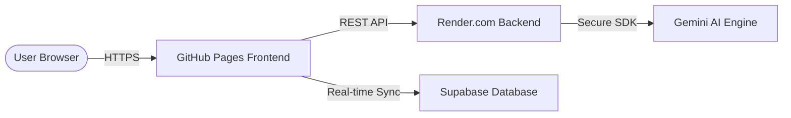

# 📘 Ansarzz Expense Tracker: Technical & Functional Guide

## 1. 🚀 Technology Stack
The application is built using a modern, performant, and type-safe stack:
*   **Frontend:** React 19 (TypeScript) for UI logic.
*   **Styling:** Vanilla CSS with **Glass-morphism** design principles and **Framer Motion** for smooth transitions and animations.
*   **State Management:** React Context API with `useReducer` for predictable state transitions.
*   **Backend/Database:** **Supabase** (PostgreSQL) for cloud synchronization and persistent storage.
*   **Build Tool:** Vite for lightning-fast development and optimized production builds.
*   **Utilities:** `PapaParse` for robust CSV processing and custom SVG logic for data visualization.

## 2. 🏗️ Architecture & Full-Stack Layout

The application follows a modern **Decoupled Full-Stack Architecture**, ensuring high security, scalability, and a professional developer workflow.

### A. The Big Picture

### B. Frontend Layer (The UI)
*   **Hosting:** GitHub Pages.
*   **Environment Logic:** Uses a "Baked-in" `VITE_BACKEND_URL` during the GitHub Actions build process to route requests to the production API.
*   **Security:** Zero exposure of AI API keys. The frontend only communicates with its own trusted backend.

### C. Backend Layer (The Brain)
*   **Hosting:** Render.com (Node.js/Express).
*   **Structure:**
    *   `config/`: Manages AI model initialization and environment variables.
    *   `controllers/`: Contains the core business logic for parsing transactions and generating insights.
    *   `routes/`: Defines clean RESTful endpoints for the frontend to consume.
*   **AI Integration:** Leverages the **Gemini 2.5 Flash** model for high-speed, natural language financial processing.

### D. CI/CD & Dev Workflow
*   **Local Dev:** A unified `npm run dev` command uses **Concurrently** to spin up both the Vite dev server and the Express backend, with a Vite proxy handling seamless request routing.
*   **Automated Deployment:** GitHub Actions automatically builds the React app and injects production secrets, ensuring the live site is always in sync with the `main` branch.

---

## 3. 🧠 Core Logic & Features
The app uses a sophisticated calculation for the **Spend Distribution** chart to ensure financial accuracy:
*   **Formula:** `Category Net Spend = Σ(Expenses) - Σ(Income)`
*   **Scenario:** If you categorize a ₹20,000 "Loan Given" as an expense and a ₹10,000 "Repayment" as income within the *same* category, the app reflects a net spend of ₹10,000.
*   **Filtering:** Only categories with a **positive net expense** are shown in the spend chart, as income-heavy categories (like "Salary") would otherwise distort the "where did my money go" visualization.

### B. Smart Grouping ("Others" Category)
To prevent "Chart Clutter," the app uses a **3% Threshold Logic**:
*   Any category that accounts for less than 3% of your total monthly spend is automatically bundled into an **"Others"** group.
*   This ensures the chart remains readable even if you have 20+ micro-categories.
*   **Drill-down:** Clicking "Others" reveals every individual transaction and its original specific category.

### C. Financial Indicators
*   **Daily Burn Rate:** Calculated as `Total Monthly Expenses / Days Passed in Month`.
*   **Estimated Runway:** Calculated as `Total Balance / Daily Burn Rate`. It tells you how many days your current cash will last if you continue spending at the same rate.
*   **Mood System:** The app dynamically changes its "Mood" (Visual background/theme) based on your budget status (Surplus, Warning, or Overspent).

---

## 3. 🛠️ Key Features & Functionality

### 📊 Data Visualization
*   **Dual View Toggle:** Switch between a **Horizontal Bar Chart** (best for comparing amounts and long text) and a **Donut Chart** (best for visualizing proportions).
*   **Historical Benchmarking:** Each category shows a trend indicator (▲/▼) compared to your **Rolling 3-Month Average**, helping you spot spending spikes.

### ➕ Transaction Management
*   **Quick Add:** For one-time expenses with "Quick Amount" chips (+₹100, +₹500, etc.).
*   **Planned/Recurring:** Supports Monthly, Quarterly, Half-Yearly, and Yearly frequencies. The app automatically generates future instances for these plans.
*   **Pending vs. Settled:** Track dues (Expected) vs. Actuals (Paid). Settling a pending item moves it into your actual balance.

### 📂 CSV Data Import
*   **Smart Mapping:** Import bank statements by mapping your CSV columns to `Date`, `Description`, `Amount`, and `Type`.
*   **Auto-Categorization:** Uses a keyword-based engine to automatically assign categories (e.g., "Uber" → Transportation, "Zomato" → Food).

---

## 4. 📖 User Guide: How to use the App

### Step 1: Initial Setup
*   **Categories:** Go to the "Add Transaction" section. You can use the default categories or click **"+ Add New Category"** to create custom ones (you can even add multiple at once separated by commas).

### Step 2: Daily Usage
1.  **Adding Spend:** Use **Quick Add** for daily coffee or groceries.
2.  **Tracking Loans/Lending:** 
    *   When you lend money, add it as an **Expense** under a "Loan" category.
    *   When they pay you back, add it as an **Income** under the *same* "Loan" category.
    *   Check **Spend Distribution** to see the net amount still "out" as a spend.

### Step 3: Planning Ahead
*   Use the **Plan Future** tab for rent, insurance, or EMIs. 
*   Check **"Dues for [Month]"** to see what you need to pay soon. 
*   Check **"Future Projections"** to see your expected balance for the next 3 months based on your recurring plans.

### Step 4: Analysis
*   Open **Spend Distribution** at the end of the week. 
*   Toggle to **Bar View** to see exactly which categories are eating your budget.
*   Look for the **Red ▲ Trend** icons—these indicate you are spending more than your 3-month average for that specific category.

---

## 5. ☁️ Cloud Sync & Security
*   **Persistence:** Your data is automatically synced to **Supabase** every 2 seconds (debounced) and also saved to your browser's **LocalStorage**.
*   **Offline Capability:** If you lose internet, you can still add transactions; they will sync the next time you open the app with a connection.
*   **Export:** Always use the **"Download CSV"** button in the header to keep a local backup of your entire financial history.

---
*Created on Sunday, April 19, 2026 for Ansarzz Expense Tracker.*
